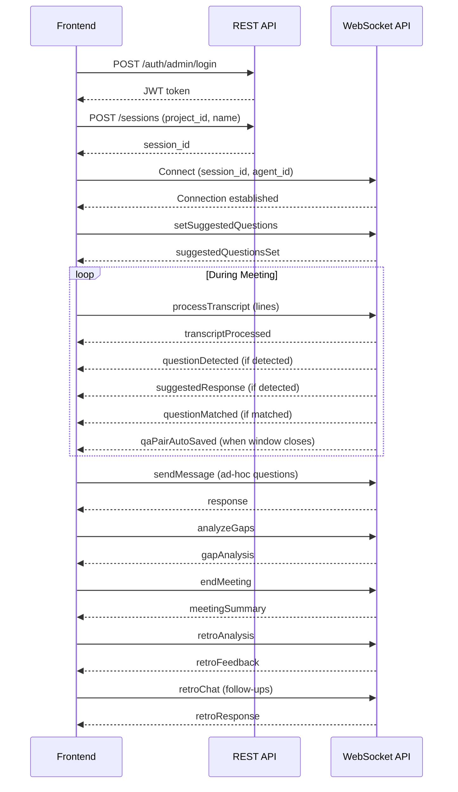

# Frontend Integration Guide

This guide covers all API endpoints, their input formats, and expected responses. Use this as the single reference for integrating the AXRAIL Meeting Tool frontend.

## Live Endpoints (Dev Environment)

| API | URL |
|---|---|
| REST API | `https://sjsd378hbd.execute-api.ap-southeast-1.amazonaws.com/dev` |
| WebSocket API | `wss://hey8o0q9tb.execute-api.ap-southeast-1.amazonaws.com/production` |

## Authentication

All REST endpoints (except login and bot credential verification) require a JWT token in the `Authorization` header:

```
Authorization: Bearer <access_token>
```

Obtain the token via the login endpoint. Tokens expire — re-authenticate if you receive a `401`.

## Response Envelope

All REST responses follow this format:

```json
{
  "statusCode": 200,
  "status": true,
  "message": "Human-readable message",
  "data": {}
}
```

Errors set `status: false`. CORS headers are included on all responses.

---

## 1. Authentication

### Admin Login

```
POST /auth/admin/login
```

```json
{
  "username": "admin@example.com",
  "password": "password"
}
```

Response `data`:

```json
{
  "access_token": "eyJ...",
  "id_token": "eyJ...",
  "refresh_token": "eyJ..."
}
```

### User Login

```
POST /auth/user/login
```

Same request/response format as admin login.

### Change Password

```
POST /auth/change-password
```

Requires auth header.

```json
{
  "username": "user@example.com",
  "previous_password": "old-password",
  "proposed_password": "new-password"
}
```

### Logout

```
POST /auth/logout
```

Requires auth header. Invalidates the current session.

---

## 2. Projects (Admin only)

| Method | Path | Description |
|---|---|---|
| `GET` | `/projects` | List all projects |
| `GET` | `/projects/{projectId}` | Get project by ID |
| `POST` | `/projects` | Create project |
| `PUT` | `/projects/{projectId}` | Update project |
| `DELETE` | `/projects/{projectId}` | Delete project |
| `GET` | `/projects/{projectId}/sessions` | List sessions for a project |
| `GET` | `/projects/{projectId}/users` | List users assigned to a project |

### Create Project

```json
{
  "name": "Project Name",
  "email": "contact@example.com",
  "description": "Optional description"
}
```

Required: `name`, `email`

---

## 3. Sessions

| Method | Path | Auth | Description |
|---|---|---|---|
| `GET` | `/sessions` | Admin+User | List sessions |
| `GET` | `/sessions/{sessionId}` | Admin+User | Get session by ID |
| `POST` | `/sessions` | Admin+User | Create session |
| `PUT` | `/sessions/{sessionId}` | Admin+User | Update session |
| `DELETE` | `/sessions/{sessionId}` | Admin | Delete session |
| `GET` | `/sessions/{sessionId}/transcripts` | Admin+User | Get session transcripts |
| `GET` | `/sessions/{sessionId}/bot-status` | Admin+User | Get meeting bot status |
| `POST` | `/sessions/{sessionId}/stop-bot` | Admin+User | Stop meeting bot |

### Create Session

```json
{
  "project_id": "uuid",
  "name": "Session Name",
  "meeting_link": "https://meet.google.com/abc-defg-hij",
  "description": "Optional"
}
```

Required: `project_id`, `name`

The session is created with `is_active: "inactive"` and `bot_status: "pending"`. If a meeting link is provided, the bot is dispatched automatically.

---

## 4. Users (Admin only)

| Method | Path | Description |
|---|---|---|
| `POST` | `/users` | Create Cognito user |
| `GET` | `/users` | List users |
| `GET` | `/users/{userId}/projects` | Get user's assigned projects |
| `POST` | `/project-users` | Assign user to project |
| `DELETE` | `/project-users/{projectUserId}` | Remove user from project |

### Assign User to Project

```json
{
  "project_id": "uuid",
  "user_id": "uuid"
}
```

---

## 5. Agents (Admin only)

| Method | Path | Description |
|---|---|---|
| `GET` | `/agents` | List agents |
| `GET` | `/agents/{agentId}` | Get agent by ID |
| `POST` | `/agents` | Create agent |
| `PUT` | `/agents/{agentId}` | Update agent |
| `DELETE` | `/agents/{agentId}` | Delete agent |

### Create Agent

```json
{
  "agent_name": "Sales Meeting Assistant",
  "role_prompt": "You are an AI Meeting Assistant...",
  "behavior_guidelines": "1. Answer questions using the knowledge base...",
  "personality_id": "existing-personality-uuid",
  "model_id": "amazon.nova-pro-v1:0",
  "use_case": "sales"
}
```

Required: `agent_name`, `role_prompt`, `behavior_guidelines`, `personality_id`, `model_id`, `use_case`

`task_prompt` is accepted as a backward-compatible alias for `behavior_guidelines`. If both are provided, `behavior_guidelines` takes precedence.

Returns `400` if `personality_id` does not exist.

GET responses include both `behavior_guidelines` and `task_prompt` fields for backward compatibility. They contain the same value.

---

## 6. Personalities (Admin only)

| Method | Path | Description |
|---|---|---|
| `GET` | `/personalities` | List personalities |
| `GET` | `/personalities/{personalityId}` | Get personality by ID |
| `POST` | `/personalities` | Create personality |
| `PUT` | `/personalities/{personalityId}` | Update personality |
| `DELETE` | `/personalities/{personalityId}` | Delete personality |

### Create Personality

```json
{
  "personality_name": "Friendly Coach",
  "personality_prompt": "Use warm, encouraging language..."
}
```

Required: `personality_name`, `personality_prompt`

Delete returns `409` if any agents reference this personality.

---

## 7. Skills (Admin only)

| Method | Path | Description |
|---|---|---|
| `GET` | `/skills?agent_id={agentId}` | List skills for an agent |
| `GET` | `/skills/{skillId}` | Get skill by ID |
| `POST` | `/skills` | Create skill (returns upload URL) |
| `PUT` | `/skills/{skillId}` | Update skill metadata |
| `DELETE` | `/skills/{skillId}` | Delete skill |

### Create Skill (two-step upload)

Step 1 — Create the skill record:

```json
{
  "agent_id": "existing-agent-uuid",
  "skill_name": "Product Pricing Guide",
  "file_name": "pricing-guide.pdf",
  "description": "Optional"
}
```

Response includes a pre-signed `upload_url`.

Step 2 — Upload the file directly to S3:

```
PUT <upload_url>
Content-Type: application/octet-stream
Body: <file bytes>
```

The S3 upload triggers automatic ingestion into the vector search index.

---

## 8. QA Pairs

| Method | Path | Auth | Description |
|---|---|---|---|
| `GET` | `/qa-pairs?session_id={id}` | Admin+User | List QA pairs by session |
| `GET` | `/qa-pairs?project_id={id}` | Admin+User | List QA pairs by project |
| `GET` | `/qa-pairs/{qaPairId}` | Admin+User | Get QA pair by ID |
| `DELETE` | `/qa-pairs/{qaPairId}` | Admin | Delete QA pair |

One of `session_id` or `project_id` is required for listing.

---

## 9. Bot Credentials (Admin only)

| Method | Path | Description |
|---|---|---|
| `GET` | `/bot-credentials` | List bot credentials |
| `POST` | `/bot-credentials` | Create bot credential |
| `GET` | `/bot-credentials/{credentialId}` | Get bot credential |
| `PUT` | `/bot-credentials/{credentialId}` | Update bot credential |
| `DELETE` | `/bot-credentials/{credentialId}` | Delete bot credential |
| `GET` | `/bot-credentials/{credentialId}/verify` | Verify email (public, no auth) |

---

## 10. Warm Pool (Admin only)

| Method | Path | Description |
|---|---|---|
| `POST` | `/warm-pool/start` | Start/scale up bot containers |
| `POST` | `/warm-pool/stop` | Stop/scale down bot containers |

---

## 11. WebSocket API

### Connecting

```
wss://hey8o0q9tb.execute-api.ap-southeast-1.amazonaws.com/production?session_id={id}&agent_id={id}
```

| Parameter | Required | Description |
|---|---|---|
| `session_id` | Yes | Associates the connection with a meeting session |
| `agent_id` | No | Loads a specific agent config. Falls back to default if omitted |

The connection persists for the entire meeting session. All actions and responses flow through the same connection.

### Message Format

Send JSON with an `action` field. Responses arrive as JSON with a `type` field.

### Actions Reference

#### sendMessage — General KB Chat

```json
{
  "action": "sendMessage",
  "session_id": "abc123",
  "message": "What were the key topics discussed?"
}
```

Response type: `response`

```json
{
  "type": "response",
  "message": "Based on the transcript, the key topics were...",
  "agent_name": "Sales Meeting Assistant"
}
```

---

#### detectQuestion — On-Demand Question Answering

```json
{
  "action": "detectQuestion",
  "session_id": "abc123",
  "question": "What is the project timeline?"
}
```

Response type: `questionResponse`

```json
{
  "type": "questionResponse",
  "message": "According to the knowledge base, the timeline is...",
  "agent_name": "Sales Meeting Assistant"
}
```

---

#### extractQAPair — Save a QA Pair

```json
{
  "action": "extractQAPair",
  "session_id": "abc123",
  "question": "What is the deadline?",
  "answer": "The deadline is next Friday."
}
```

Response type: `qaPairSaved`

---

#### analyzeGaps — Knowledge Gap Analysis

```json
{
  "action": "analyzeGaps",
  "session_id": "abc123"
}
```

Response type: `gapAnalysis`

```json
{
  "type": "gapAnalysis",
  "session_id": "abc123",
  "gaps": [
    { "topic": "...", "description": "...", "confidence": "high|medium|low" }
  ],
  "suggested_questions": ["..."]
}
```

Gap analysis results are automatically persisted. The `endMeeting` action uses stored gaps to populate the "Missed Agenda Items" chapter in the meeting summary. Running `analyzeGaps` multiple times for the same session overwrites the previous results (latest wins).

---

#### setSuggestedQuestions — Pre-Set Question Matching

```json
{
  "action": "setSuggestedQuestions",
  "session_id": "abc123",
  "questions": [
    "What is the pricing model?",
    "What security certifications do you have?"
  ]
}
```

Response type: `suggestedQuestionsSet`

```json
{ "type": "suggestedQuestionsSet", "count": 2 }
```

These questions are matched against live transcript lines via semantic similarity during `processTranscript`.

---

#### processTranscript — Live Transcript Processing

This is the primary action during a live meeting. Send transcript lines as they arrive from the transcription service.

```json
{
  "action": "processTranscript",
  "session_id": "abc123",
  "lines": [
    {
      "speaker": "spk_0",
      "text": "What is the pricing model for the enterprise tier?",
      "start_time": 559.25,
      "end_time": 564.03,
      "confidence": 0.853,
      "is_partial": false
    }
  ]
}
```

| Field | Type | Required | Description |
|---|---|---|---|
| `speaker` | string | Yes | Speaker label from transcription (e.g., `spk_0`) |
| `text` | string | Yes | Transcript text |
| `start_time` | number | Yes | Start time in seconds |
| `end_time` | number | Yes | End time in seconds |
| `confidence` | number | Yes | Transcription confidence (0-1) |
| `is_partial` | boolean | Yes | `true` for incomplete utterances (skipped by processing) |

Always-sent response:

```json
{ "type": "transcriptProcessed", "lines_processed": 1 }
```

Additional messages that may arrive on the same connection:

| Type | When | Payload |
|---|---|---|
| `questionMatched` | A line matches a pre-set suggested question | `question_text`, `spoken_text`, `similarity` |
| `questionDetected` | A line is detected as a question | `question`, `detection_method` |
| `suggestedResponse` | KB-sourced answer for a detected question | `question`, `suggested_answer` |
| `qaPairAutoSaved` | An answer window closed with collected lines | `question`, `answer`, `source` |
| `questionUnanswered` | An answer window closed with no lines | `question` |

Partial lines (`is_partial: true`) are stored but skipped by question detection and matching. Send final (non-partial) lines for full processing.

---

#### endMeeting — Generate Meeting Summary

```json
{
  "action": "endMeeting",
  "session_id": "abc123"
}
```

Sends two messages:

1. `{ "type": "status", "message": "Generating meeting summary..." }`
2. `{ "type": "meetingSummary", "session_id": "...", "summary_markdown": "## Meeting Summary\n\n**Participants:** ...\n**Date:** 2025-01-15\n...\n\n## Missed Agenda Items\n\n...\n\n## Action Items / Next Steps\n\n...\n\n## Session Insights\n\n..." }`

The summary is a structured markdown document with exactly four `##` chapters:

1. **Meeting Summary** — Participants, date (ISO 8601), key topics, and decisions
2. **Missed Agenda Items** — Cross-references the transcript against stored gap analysis results. Lists knowledge gaps that were identified but never addressed during the meeting. If no gap analysis was run for the session, notes that no gap analysis was performed.
3. **Action Items / Next Steps** — Concrete items with owners, deadlines, and follow-ups
4. **Session Insights** — Patterns, communication effectiveness, notable moments, and recommendations

The summary is saved to S3 and ingested into the knowledge base. The session is marked inactive.

---

#### retroAnalysis — Post-Meeting Coaching

Requires `endMeeting` to have been called first.

```json
{
  "action": "retroAnalysis",
  "session_id": "abc123"
}
```

Response type: `retroFeedback`

```json
{
  "type": "retroFeedback",
  "session_id": "abc123",
  "feedback": "## Retrospective Analysis\n\n### Communication Effectiveness: 7/10..."
}
```

---

#### retroChat — Follow-Up Questions

Requires `retroAnalysis` to have been run on the same connection.

```json
{
  "action": "retroChat",
  "session_id": "abc123",
  "message": "What were the main action items?"
}
```

Response type: `retroResponse`

---

### WebSocket Error Format

```json
{
  "type": "error",
  "message": "Description of what went wrong"
}
```

Common errors:
- `"Missing 'message' field"` — required field not provided
- `"Missing or empty 'lines' field"` — processTranscript called with no lines
- `"Retro mode is only available for completed sessions"` — retroAnalysis on active session
- `"No retro analysis found. Run retroAnalysis first."` — retroChat without prior retroAnalysis

---

## Typical Meeting Flow



## REST Error Codes

| Code | Meaning |
|---|---|
| 200 | Success |
| 400 | Bad request — missing or invalid fields |
| 401 | Unauthorized — invalid or expired token |
| 403 | Forbidden — insufficient permissions |
| 404 | Resource not found |
| 409 | Conflict — referential integrity violation (e.g., deleting a personality used by an agent) |
| 500 | Internal server error |
