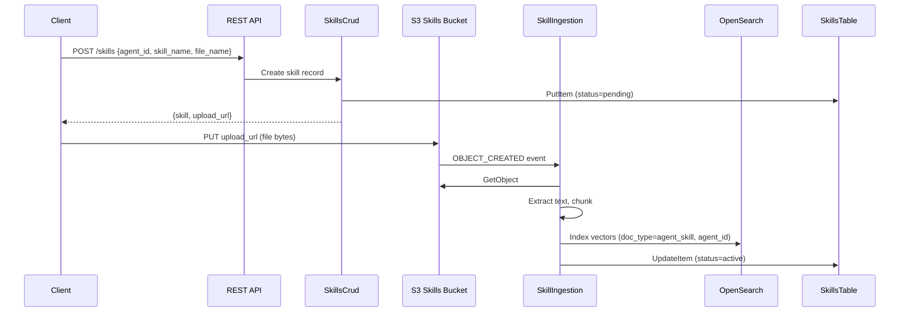

# Agent Skills

## Overview

Agent Skills allow attaching specific knowledge documents to individual agents. Each agent can have its own set of skill documents (PDF or Markdown) that are ingested into the shared OpenSearch index with agent-scoped metadata. During conversations, the agent searches its skill documents first before falling back to the general knowledge base.

## Skill Lifecycle

## Pre-Signed URL Upload Flow

The create endpoint returns a pre-signed S3 PUT URL instead of accepting file bytes directly. This avoids the Lambda 6MB synchronous payload limit and allows uploading files of any size supported by S3.

1. `POST /skills` creates a DynamoDB record with `status: "pending"` and returns an `upload_url`
2. The client uploads the file directly to S3 using the pre-signed URL (valid for 15 minutes)
3. The S3 OBJECT_CREATED event triggers the SkillIngestion Lambda automatically

## OpenSearch Indexing

Skill vectors are stored in the same `knowledge-vectors` index as KB documents, distinguished by two fields:

- `doc_type: "agent_skill"` — Separates skill vectors from `user_upload` and `meeting_summary` types
- `agent_id` — Scopes skill vectors to a specific agent

This allows the `search_agent_skills` tool to filter by both fields, ensuring an agent only sees its own skill documents.

Each skill document is processed identically to KB documents: text extraction (PyPDF2 for PDF, UTF-8 for Markdown), chunking (1000 chars, 200 overlap), and embedding (Titan Embed Text V2, 1024 dimensions).

## System Prompt Enrichment

When a WebSocket connection is established with an `agent_id`, the connection handler:

1. Queries the SkillsTable for active skills belonging to that agent
2. If skills exist, appends a section to the system prompt listing each skill's name and description
3. Instructs the agent to search skill documents first using `search_agent_skills` before the general knowledge base

Agents without skills get the same system prompt as before — the enrichment is conditional.

## Deletion Cascade

When a skill is deleted via `DELETE /skills/{skillId}`:

1. The SkillsCrud Lambda deletes the DynamoDB record and the S3 object
2. The S3 OBJECT_REMOVED event triggers the SkillDeletion Lambda
3. The SkillDeletion Lambda queries OpenSearch for documents matching the `source_file` AND `doc_type: "agent_skill"` and deletes them

The compound query ensures only skill vectors are removed — KB vectors with the same filename are unaffected.

## API Reference

See [REST API — Skills](../api/README.md#skills) for endpoint details and [WebSocket API — Agent Tools](../api/websocket-api.md#agent-tools) for tool availability.
