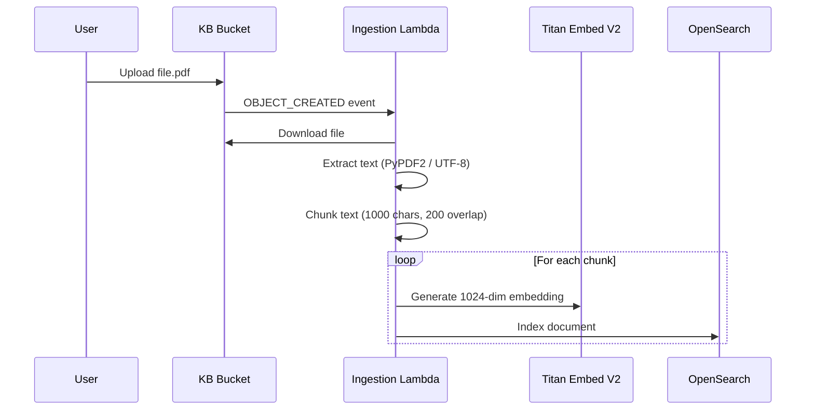

# Knowledge Base Ingestion Pipeline

## Overview

The ingestion pipeline automatically processes documents uploaded to the KB S3 bucket, extracts text, generates vector embeddings, and indexes them in OpenSearch for semantic search.

## How It Works

## Supported File Types

| Extension | Extraction Method |
|---|---|
| `.pdf` | PyPDF2 text extraction |
| `.md` | Raw UTF-8 decode |

## S3 Key Format

Files should be uploaded with the key format: `{project_id}/{filename}.pdf`

The `project_id` is extracted from the first path segment. If no prefix exists, the `PROJECT_ID` environment variable is used as fallback.

Meeting summaries saved by `endMeeting` use the path `{project_id}/summaries/{session_id}.md` and are tagged with `doc_type: "meeting_summary"`. All other uploads are tagged `doc_type: "user_upload"`.

## Deletion

When a file is removed from the KB bucket, the Deletion Lambda automatically removes all corresponding vectors from OpenSearch by matching the `source_file` field.

## Retry Logic

Bedrock embedding calls and OpenSearch indexing operations use exponential backoff with up to 3 retries (1s, 2s, 4s).

## Current Routing

All files go to the shared KB bucket with the `{project_id}/` key prefix convention. S3 event notifications on the shared bucket trigger the Ingestion Lambda for all uploads. A future enhancement could configure per-project S3 buckets with individual event notifications.
