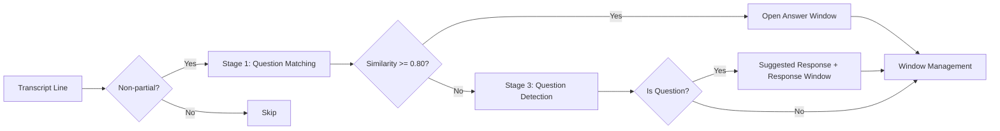

# Live Transcript Processing

## Overview

The `processTranscript` WebSocket action handles real-time meeting transcript lines. It processes all incoming lines without speaker classification, stores transcript entries, matches questions against pre-set topics, detects questions, and captures answers automatically.

## Three-Stage QA Pipeline

### Stage 1: Suggested Question Matching

Before the meeting, call `setSuggestedQuestions` to store questions with embeddings. During the transcript, each non-partial line is embedded and compared against unmatched questions using cosine similarity.

Threshold: **0.80** (configurable in `constants.py` as `MATCH_THRESHOLD`)

### Stage 2: Answer Window Capture

When a question is matched, an answer window opens to capture subsequent lines as the answer. Close conditions:
- 5 lines collected
- New question detected in an incoming line
- 60-second timeout

Captured QA pairs are saved with `source: "participant"`.

### Stage 3: Question Detection

All non-partial lines are checked for questions using a two-tier approach:

1. **Heuristic check** — Ends with `?` or starts with an interrogative word (`what`, `how`, `why`, `when`, `where`, `who`, `which`, `can you`, `could you`, etc.)
2. **Model check** — If heuristics are inconclusive, Nova Pro classifies the text

Filter: Lines shorter than 5 words are skipped to avoid false positives.

When a question is detected:
- A `questionDetected` message is sent
- A suggested response is generated from the knowledge base
- A response window opens to capture the verbal answer that follows (saved with `source: "participant"`)

The response window follows the same close conditions as the answer window (5 lines / new question detected / 60s timeout).

## Transcript Storage

All transcript lines are batch-written to the TranscriptsTable with fields: `transcript_id`, `session_id`, `speaker`, `text`, `timestamp`, `start_time`, `end_time`, `confidence`, `is_partial`.

> **Note:** The `speaker_role` field is no longer assigned by the processing pipeline. Existing records may still contain `speaker_role` from prior multi-channel processing, but new entries will not include it.

A rolling buffer of the last 50 lines is maintained in memory for context.

## Known Limitation

The answer window and user response window state is ephemeral (in-memory). If the Lambda cold-starts between transcript batches, open windows are lost. For reliable capture, send the question and expected answer lines in the same `processTranscript` batch when possible. A future enhancement could persist window state in DynamoDB.
