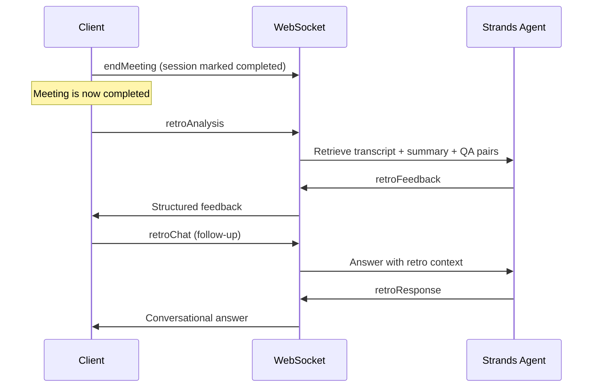

# Retrospective Mode

## Overview

Retro mode provides post-meeting analysis and coaching feedback. It is only available after a meeting has been ended via `endMeeting`.

## Workflow

## Retro Analysis Sections

The `retroAnalysis` action generates structured feedback covering:

- Missed Agenda Items — topics that should have been covered
- Communication Effectiveness — score 1-10 with specific transcript references
- Question Handling Quality — were questions answered well?
- Action Item Completeness — were action items clearly defined with owners?
- Knowledge Gap Assessment — topics that lacked KB coverage
- Coaching Insights — actionable improvement suggestions with transcript evidence
- Overall Meeting Effectiveness — rating 1-10 with justification

## Retro Chat

After running `retroAnalysis`, the `retroChat` action allows follow-up questions about the analysis. The retro context (feedback, transcript, summary) is maintained in the connection cache for the duration of the WebSocket session.

## Prerequisites

- The session must be completed (`endMeeting` called first)
- `retroAnalysis` must be run before `retroChat` on the same connection
- Retro context is lost if the WebSocket disconnects — reconnect and run `retroAnalysis` again
